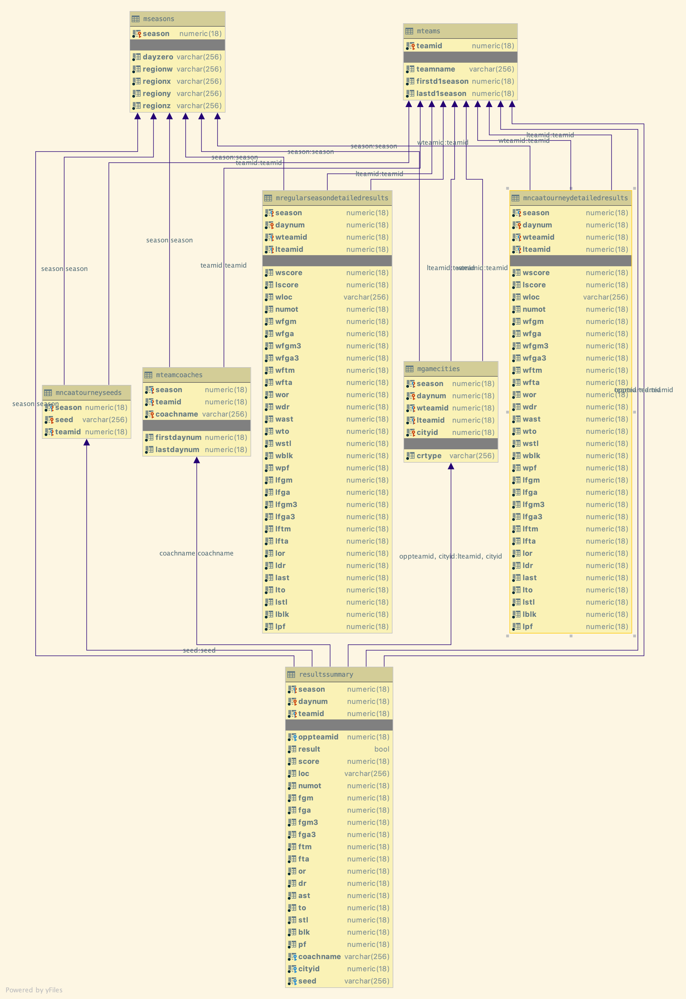
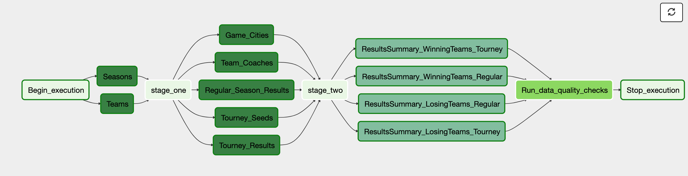

# NCAA March Madness - Analytics

NCAA March Madness, is a single-elimination tournament played each spring in the United States, currently featuring 68 college basketball teams from the Division I level of the National Collegiate Athletic Association (NCAA), to determine the national championship. The tournament was created in 1939 by the National Association of Basketball Coaches, and was the idea of Ohio State coach Harold Olsen. Played mostly during March, it has become one of the most famous annual sporting events in the United States

The data for this project has been provided by Kaggle and Google as described [here] [1] I have chosen this dataset since it is large and has data going back to 1985 and provides a good base for doing predictions on the games using Machine Learning. 

[1]: <https://www.kaggle.com/c/google-cloud-ncaa-march-madness-2020-division-1-mens-tournament/overview>

## Scope of Project

- Design database schema for staging tables, fact tables and dimension tables
- Stage data from Amazon S3 to Amazon Redshift
- Transform and insert data from staging tables to fact and dimension tables
- Use Apache Airflow to create pipeline to accomplish above tasks
- Transform data using Spark to suit the needs of Machine Learning
 

## Data

#### MTeams.csv
This file identifies the different college teams present in the dataset. Each school is uniquely identified by a 4 digit id number.

#### MSeasons.csv
This file identifies the different seasons included in the historical data, along with certain season-level properties.

#### MNCAATourneySeeds.csv
This file identifies the seeds for all teams in each NCAA® tournament, for all seasons of historical data. Thus, there are between 64-68 rows for each year, depending on whether there were any play-in games and how many there were. 

#### MRegularSeasonDetailedResults.csv
This file provides team-level box scores for many regular seasons of historical data, starting with the 2003 season. All games listed in the MRegularSeasonCompactResults file since the 2003 season should exactly be present in the MRegularSeasonDetailedResults file.

#### MNCAATourneyDetailedResults.csv
This file provides team-level box scores for many NCAA® tournaments, starting with the 2003 season. All games listed in the MNCAATourneyCompactResults file since the 2003 season should exactly be present in the MNCAATourneyDetailedResults file.

#### MGameCities.csv 
This file identifies all games, starting with the 2010 season, along with the city that the game was played in.

#### MTeamCoaches.csv
This file indicates the head coach for each team in each season, including a start/finish range of DayNum's to indicate a mid-season coaching change.

## Database Schema

We use Amazon Redshift for our Data Warehouse. It is chosen since the data is stored in S3 and we can easily interact with other Amazon services. Redshift uses Postgres and since each file are tightly coupled with other files, we can utilise the benefits of a relational database.

#### ER Diagram
We have designed the following schema to store the data and it follows Snowflake pattern.

 

#### Fact Tables

- ResultsSummary

#### Dimension Tables

- MNCAATourneyDetailedResults
- MRegularSeasonDetailedResults
- MTeamCoaches
- MNCAATourneySeeds
- MGameCitites

#### Other dependent tables

- MSeasons
- MTeams

The complete DDL statements for creating tables are in the file `create_ncaa_tables.py`.

####  
 
 ## ETL
 
 #### Airflow Pipeline
 
  
 
 #### Task Dependencies
 All other tables have a foreign key dependency on `Seasons` and `Teams` tables. So we load them first and then load the other dimension tables. And the tables in stage one doesn't have dependency among themselves, so they can be parallelized. Once it is completed, we can load the fact table. Although we have four tasks, all of them will populate the same table with different data.
 
 #### Operators
 Following new operators are created:
 
 - `StageToRedshiftCSVOperator`: to stage the Stage 1 and Stage 2 CSV files stored in Amazon S3 to Redshift.
 - `LoadFactOperator`: to extract the data from Stage 2 files, transform it and load into the final table
 - `DataQualityOperator`: To check if records are inserted in the final table
 
 ## Transform Data for Machine Learning
 
 We use Apache spark to transform data, factorize the categorical variables, and make it usable for ML training.
 
 Following steps are done:
 
 - Read data from Amazon Redshift to PySpark
 - ML Pipeline:
    1. `StringIndexer` to categorize the values
    2. `OneHotEncoderEstimator` to one-hot encode the values to multiple columns
    3. `VectorAssembler` to assemble the above columns to feature vector
 - Split the data into training and test datasets 
 
 ##Summary
 
 #### Goal of the project
 
 To develop an ETL infrastructure that delivers the proper data to the Machine Learning team, so that they can train it and predict the winning team of each March Madness game and also do analytics on it.
 
 #### Sample Queries
 
 - 