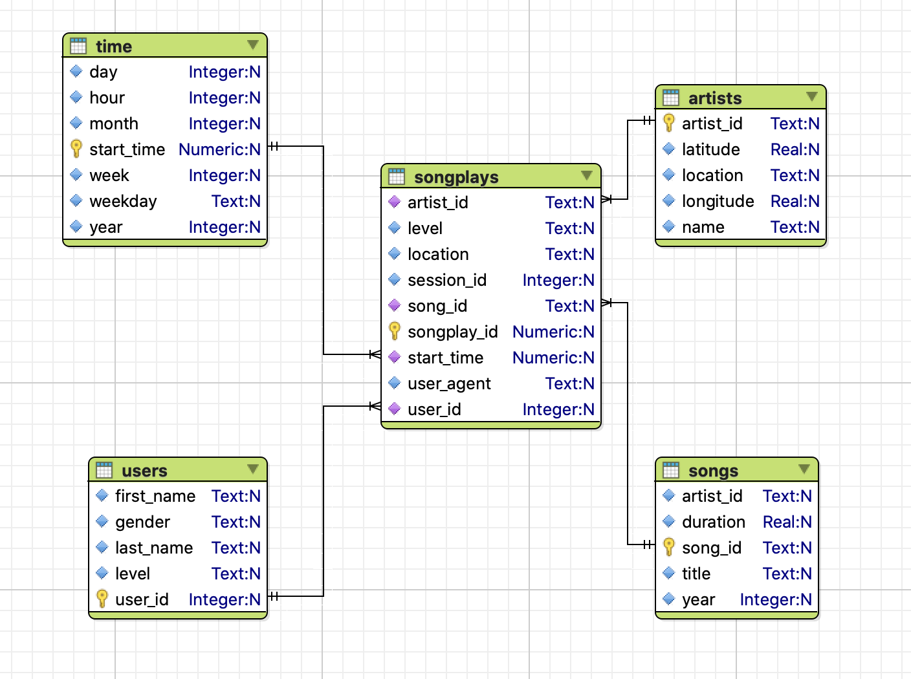

# Sparkify ETL Design and Development

## Purpose of the Database

The objective is to create a spark backend for songs and user activity on Sparkify's new music streaming app and build ETL pipeline for song play analysis. 

## Spark Schema

Star schema is choosen for this database with one fact table and four dimension tables.

### ER Diagram

 "ER Diagram of the Star Schema"

### Fact Table

**songplays**:Records in log data associated with song plays i.e. records with page NextSong

1. songplay_id serial primary key
2. start_time timestamp references time(start_time)
3. user_id integer references users(user_id)
4. level varchar(20)
5. song_id varchar(18) references songs(song_id)
6. artist_id varchar(18) references artists(artist_id)
7. session_id integer
8. location varchar(100)
9. user_agent varchar(200)

### Dimension Tables

**users**:Users in the app

1. user_id integer primary key
2. first_name varchar(35)
3. last_name varchar(35)
4. gender varchar(1)
5. level varchar(20)

**songs**:songs in music database

1. song_id varchar(18) primary key
2. title varchar(100)
3. artist_id varchar(18)
4. year integer
5. duration float

**artists** artists in music database

1. artist_id varchar(18) primary key
2. name varchar(100)
3. location varchar(100)
4. latitude float
5. longitude float

**time**:timestamps of records in songplays broken down into specific units

1. start_time timestamp primary key
2. hour integer
3. day integer
4. week integer
5. month integer
6. year integer
7. weekday varchar(9)

## How the ETL pipeline is structured

1. Establish spark connection
2. Read songs and artists information from the JSON files in `data/songs` directory.
3. Extract the relevant information for songs datframe and write to a parquet file
4. Extract the relevant information for artists datframe and write to a parquet file
5. Read time information information from the JSON files in `data/logs` directory.
6. Insert the time data into time, users and songplays table

## Usage

1. Run the script `etl.py`: `python etl.py`